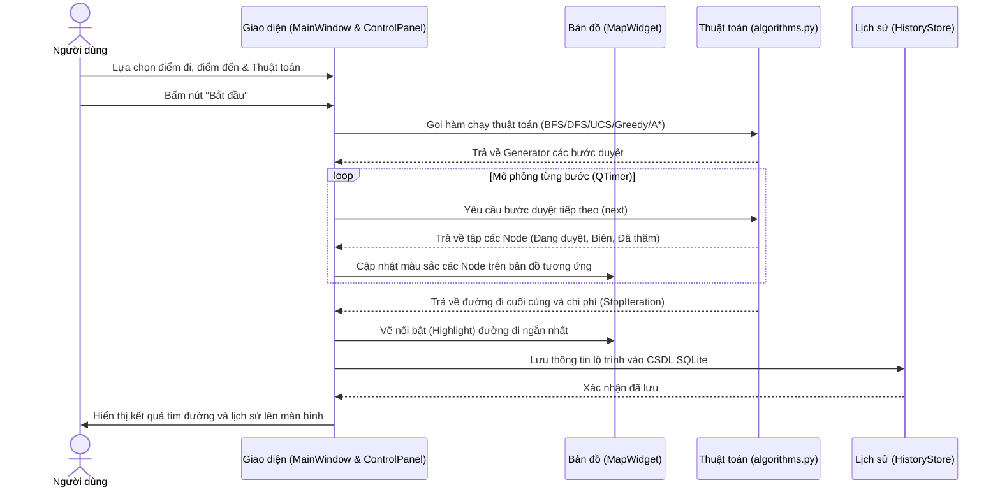

# BÁO CÁO Ý CHÍNH PROJECT ỨNG DỤNG TÌM ĐƯỜNG HCMUTE

> **Nhận xét từ codebase:** Tài liệu này được phân tích và tổng hợp trực tiếp từ mã nguồn thực tế của dự án. Mọi nhận xét, tính năng và luồng hoạt động đều bám sát các file code hiện có.

---

## Chương 1: Mở đầu

### 1.1 Mục tiêu đề tài
Dựa trên codebase (đặc biệt là file `main.py` và `core/algorithms.py`), dự án hướng đến xây dựng **ứng dụng desktop tìm đường đi tối ưu trong khuôn viên Trường Đại học Sư phạm Kỹ thuật TP.HCM (HCMUTE)**. Hệ thống giúp mô hình hóa bản đồ khuôn viên thành đồ thị và áp dụng 5 thuật toán tìm kiếm phổ biến (BFS, DFS, UCS, Greedy, A*) để tìm đường giữa hai địa điểm. Ứng dụng cũng trực quan hóa quá trình tìm kiếm từng bước trên giao diện đồ họa.

### 1.2 Đối tượng nghiên cứu và phục vụ
- **Đối tượng nghiên cứu:** Bản đồ khuôn viên HCMUTE (được trừu tượng hóa thành đồ thị với các node và edge), 5 thuật toán tìm kiếm (có sử dụng khoảng cách Euclidean và Manhattan làm heuristic), thư viện giao diện PyQt6, và SQLite lưu trữ lịch sử.
- **Đối tượng phục vụ:** Sinh viên, giảng viên, nhân viên và khách đến thăm trường cần tìm lộ trình di chuyển giữa các tòa nhà, khu vực trong khuôn viên HCMUTE.

### 1.3 Phạm vi đề tài
Phạm vi hiện tại của dự án:
- Ứng dụng chạy trên nền tảng **Desktop** (Python + PyQt6).
- Sử dụng **bản đồ 2D tĩnh** (`assets/map.png`).
- Tìm đường giữa 65 điểm nút có sẵn (được định nghĩa trong file JSON), không sử dụng GPS thực tế.
- Hỗ trợ mô phỏng thuật toán qua animation.
- Có tính năng chỉnh sửa đồ thị cơ bản trên UI và lưu lại vào JSON.
- Có lưu lịch sử các lần tìm đường vào cơ sở dữ liệu SQLite.

### 1.4 Dự kiến nội dung đạt được
- Xây dựng bản đồ HCMUTE dạng 2D: ✅ Đã triển khai (`assets/map.png`).
- Mô hình hóa bản đồ thành đồ thị: ✅ Đã triển khai (`core/graph.py` và `data/hcmute_graph_nodes_edges.json`).
- Cài đặt các thuật toán BFS, DFS, UCS, Greedy, A*: ✅ Đã triển khai (`core/algorithms.py`).
- Hiển thị đường đi trên giao diện: ✅ Đã triển khai (`ui/map_widget.py`).
- Mô phỏng quá trình tìm kiếm: ✅ Đã triển khai (Sử dụng Generator và `QTimer` trong `ui/main_window.py`).
- Chỉnh sửa node/cạnh: ✅ Đã triển khai (`ui/graph_editor_dialog.py`).
- Lưu lịch sử tìm đường: ✅ Đã triển khai (`core/history_store.py` và `ui/history_dialog.py`).

---

## Chương 2: Cơ sở lý thuyết

### 2.1 Tổng quan về bài toán tìm đường đi trên bản đồ
Bài toán tìm đường trong khuôn viên HCMUTE nhận **đầu vào** là một điểm xuất phát (node) và một điểm đích (node) trên đồ thị bản đồ. **Đầu ra** là một chuỗi các đỉnh liên tiếp tạo thành lộ trình từ điểm bắt đầu đến điểm đích. Tùy thuộc vào thuật toán sử dụng, lộ trình này có thể là đường đi ngắn nhất (tối ưu) hoặc một đường đi bất kỳ tìm thấy được.

### 2.2 Cơ sở lý thuyết về đồ thị

#### 2.2.1 Khái niệm đồ thị
Đồ thị gồm tập đỉnh (V) và tập cạnh (E). Trong dự án, mỗi địa điểm hoặc giao lộ trong trường (ví dụ: Cổng chính, Khối A, Thư viện) là một Node. Mỗi đoạn đường di chuyển nội bộ nối giữa hai Node là một Edge.

#### 2.2.2 Đồ thị vô hướng có trọng số
Kiểm tra trong `core/graph.py`, khi thêm cạnh, mã nguồn nối hai chiều:
```python
self.adjacency[source].append((target, weight))
self.adjacency[target].append((source, weight))
```
Do đó, đồ thị là **vô hướng**. Thuộc tính `weight` của cạnh đại diện cho **trọng số** (khoảng cách Euclidean bằng pixel giữa hai node).

#### 2.2.3 Biểu diễn đồ thị bằng danh sách kề
Project sử dụng **danh sách kề (Adjacency List)** để biểu diễn đồ thị. Trong class `Graph` (`core/graph.py`), biến `self.adjacency` là một Dictionary ánh xạ từ ID của node (kiểu string) sang một danh sách các tuple `(neighbor_id, weight)`.

#### 2.2.4 Node, Edge và trọng số cạnh trong bản đồ
- **Node:** Được định nghĩa bởi class `Node` gồm: `id` (Mã định danh), `x`, `y` (Tọa độ pixel), `name` (Tên hiển thị, nếu trống sẽ ẩn tên).
- **Edge:** Class `Edge` gồm `source` (Node bắt đầu), `target` (Node kết thúc), và `weight` (Trọng số). Trọng số được lấy trực tiếp từ file JSON, hoặc tính tự động dựa trên khoảng cách Euclidean (Pixel) trong giao diện Editor.

### 2.3 Mô hình hóa bản đồ HCMUTE thành đồ thị
Hệ thống sử dụng ảnh `assets/map.png` làm bản đồ nền. Tọa độ của các địa điểm trên ảnh được trích xuất thủ công hoặc qua Editor, tạo thành 65 node và 80 cạnh lưu trong `data/hcmute_graph_nodes_edges.json`. Khi khởi động, hàm `Graph.load_from_json()` sẽ nạp file này để xây dựng cấu trúc đồ thị.

### 2.4 Cơ sở lý thuyết về các thuật toán tìm kiếm
Tất cả 5 thuật toán trong `core/algorithms.py` đều được thiết kế dưới dạng **Generator** (`yield` trạng thái) để phục vụ cho tính năng mô phỏng trực quan.

#### 2.4.1 Thuật toán BFS
Cài đặt bằng hàng đợi FIFO (`collections.deque`). Thuật toán duyệt qua các đỉnh kề theo từng mức, không xét đến trọng số. Thích hợp để tìm đường đi đi qua ít đoạn đường nhất, nhưng không phải khoảng cách ngắn nhất.

#### 2.4.2 Thuật toán DFS
Cài đặt bằng ngăn xếp LIFO (`list.pop()`). Thuật toán đi sâu xuống từng nhánh cho đến khi hết đường hoặc gặp đích. Không đảm bảo tìm được đường đi ngắn nhất.

#### 2.4.3 Thuật toán UCS
Cài đặt bằng hàng đợi ưu tiên Min-Heap (`heapq`). Node được mở rộng dựa trên chi phí tích lũy `g(n)` nhỏ nhất. Đảm bảo tìm được đường đi ngắn nhất về mặt trọng số.

#### 2.4.4 Thuật toán A*
Sử dụng hàm heuristic (Euclidean hoặc Manhattan) để ước lượng khoảng cách từ nút hiện tại đến đích, kết hợp với chi phí thực tế từ điểm bắt đầu để hướng việc tìm kiếm về phía đích nhanh hơn. Thuật toán đảm bảo tìm được đường đi ngắn nhất nếu hàm heuristic là chấp nhận được (admissible).

---

## Chương 3: Thiết kế và cài đặt

### 3.1 Tổng quan hệ thống
Hệ thống được thiết kế theo kiến trúc phân lớp hướng đối tượng rõ ràng (kiểu MVC đơn giản), tách biệt giữa phần lưu trữ dữ liệu, phần thuật toán xử lý cốt lõi và phần hiển thị giao diện người dùng (UI). 

Cấu trúc thư mục của dự án như sau:
```
HCMUTE_Pathfinding_App/
│
├── main.py                     # Entry point khởi chạy ứng dụng
├── pyrightconfig.json          # Cấu hình Type Checker
├── requirements.txt            # Thư viện phụ thuộc
│
├── core/                       # Lớp xử lý logic và dữ liệu nền
│   ├── __init__.py
│   ├── algorithms.py           # Triển khai 5 thuật toán tìm đường (Generator)
│   ├── graph.py                # Mô hình hóa Đồ thị, Node, Edge và đọc/ghi JSON
│   ├── heuristic.py            # Hàm tính khoảng cách Euclidean và Manhattan
│   ├── history_store.py        # Lưu trữ lịch sử tìm đường vào SQLite
│   └── utils.py                # Các hàm bổ trợ (Timer đo hiệu năng, format dữ liệu)
│
└── ui/                         # Lớp giao diện người dùng (PyQt6)
    ├── __init__.py
    ├── main_window.py          # Khung ứng dụng chính, quản lý Event Loop & QTimer
    ├── map_widget.py           # Render bản đồ đồ họa và các node/cạnh
    ├── control_panel.py        # Bảng điều khiển chọn thuật toán, tham số, hiển thị log
    ├── welcome_screen.py       # Màn hình Splash nạp tài nguyên lúc khởi động
    ├── graph_editor_dialog.py  # Dialog chỉnh sửa đồ thị trực quan hoặc qua Grid
    └── history_dialog.py       # Dialog hiển thị danh sách lịch sử tìm đường từ SQLite
```

Hệ thống được thiết kế theo nguyên tắc Separation of Concerns. Mã nguồn khởi chạy trong [main.py](file:///d:/Đồ án AI/HCMUTE_Pathfinding_App/main.py) có nhiệm vụ cấu hình ban đầu (Font chữ mặc định, Style giao diện Fusion của Qt) và mở màn hình Splash chào mừng:

```python
# Minh họa Entry Point khởi chạy ứng dụng
def main():
    # Khởi tạo tiến trình ứng dụng giao diện đồ họa
    app = InitializeGUIApp()
    
    # Thiết lập giao diện, phông chữ mặc định của hệ thống
    app.set_theme("Fusion")
    app.set_default_font("Segoe UI", 10)
    
    # Hiển thị màn hình chào mừng (Splash Screen) nạp dữ liệu
    splash = ShowWelcomeScreen()
    
    # Khởi chạy vòng lặp sự kiện chính của ứng dụng
    app.run()
```

### 3.2 Sơ đồ tổng quát hệ thống
Dưới đây là sơ đồ tương tác tuần tự giữa các thành phần khi người dùng thao tác thực hiện tìm kiếm đường đi trên bản đồ khuôn viên HCMUTE:



### 3.3 Chi tiết các chức năng chính

#### 3.3.1 Giao diện bản đồ
Giao diện bản đồ được dựng bằng `QGraphicsView` và `QGraphicsScene` để xử lý hệ tọa độ 2D của ảnh nền bản đồ, cho phép thu phóng (zoom) và di chuyển (pan).
Để hiển thị thông tin điểm Bắt đầu / Điểm đích nổi bật trên bản đồ, hệ thống định nghĩa các tooltip hiển thị thông tin:

```python
# Minh họa cấu trúc tooltip hiển thị thông tin điểm đi/đến
class TooltipIllustration:
    def __init__(self, location_name: str, is_start: bool):
        self.name = location_name
        self.color = "GREEN" if is_start else "RED"  # Điểm bắt đầu màu xanh, điểm đích màu đỏ
        
    def draw(self, painter):
        # Vẽ bong bóng thông tin chỉ xuống tọa độ điểm trên bản đồ
        painter.draw_bubble(text=self.name, border_color=self.color, background="WHITE")
```

Quá trình dựng đồ thị vector trên bản đồ được thực hiện bằng cách duyệt qua danh sách các Node và Edge lấy từ lớp `Graph` để tạo và vẽ các đối tượng đồ họa:

```python
# Minh họa vẽ đồ thị (Node và Edge) lên giao diện bản đồ
class MapRenderer:
    def render(self, graph):
        # Vẽ tất cả các cạnh kết nối (đường đi giữa các địa điểm)
        for edge in graph.edges:
            self.draw_line(
                from_x=edge.source.x, from_y=edge.source.y,
                to_x=edge.target.x, to_y=edge.target.y,
                color="GRAY", width=2
            )
            
        # Vẽ tất cả các nút (địa điểm / giao lộ trong trường)
        for node in graph.nodes:
            self.draw_node_circle(
                x=node.x, y=node.y, 
                label=node.name, 
                radius=6, color="BLUE"
            )
```

#### 3.3.2 Chức năng tìm đường đi
Chức năng cốt lõi này kết nối Lớp điều khiển [main_window.py](file:///d:/Đồ án AI/HCMUTE_Pathfinding_App/ui/main_window.py) và Lớp thuật toán [algorithms.py](file:///d:/Đồ án AI/HCMUTE_Pathfinding_App/core/algorithms.py). Mọi thuật toán tìm kiếm đều trả về một `Generator` của Python.
Khi người dùng bấm nút "Bắt đầu", MainWindow kiểm tra cấu hình thuật toán và tham số heuristic rồi khởi tạo generator:

```python
# Minh họa khởi tạo và chọn thuật toán tìm đường
def start_pathfinding(start_node, goal_node, algorithm_name, heuristic_name):
    # Lấy hàm thuật toán tương ứng dựa vào tên
    algo = get_algorithm_by_name(algorithm_name)
    
    if algorithm_needs_heuristic(algorithm_name):
        # Thuật toán cần heuristic (như A*, Greedy) thì truyền thêm hàm heuristic
        heuristic = get_heuristic_by_name(heuristic_name)
        search_process = algo(graph, start_node, goal_node, heuristic)
    else:
        # Thuật toán không cần heuristic (BFS, DFS, UCS)
        search_process = algo(graph, start_node, goal_node)
        
    return search_process  # Trả về đối tượng Generator để mô phỏng từng bước
```

Quá trình mô phỏng trực quan từng bước lan tỏa (tô màu node Đang duyệt, node Biên và node Đã thăm) được điều khiển qua sự kiện tick của `QTimer`:

```python
# Minh họa mô phỏng từng bước của thuật toán bằng bộ đếm thời gian (QTimer)
def on_timer_tick(search_generator):
    try:
        # Lấy trạng thái bước tiếp theo từ Generator của thuật toán tìm kiếm
        step_data = next(search_generator)
        
        # Cập nhật trạng thái các node trên bản đồ giao diện trực quan
        update_ui_map(
            current=step_data["current_node"],   # Node hiện tại đang xét
            visited=step_data["visited_nodes"],   # Danh sách các node đã duyệt qua
            frontier=step_data["frontier_nodes"] # Hàng đợi/Ngăn xếp các node biên chờ duyệt
        )
        
        # Cập nhật bảng thông tin thống kê thời gian thực
        update_ui_stats(
            distance=step_data["current_cost"], 
            visited_count=len(step_data["visited_nodes"])
        )
        
        # Nếu đã tìm thấy đích hoặc kết thúc tìm kiếm
        if step_data["finished"]:
            show_final_path(step_data["path"])
            stop_timer()
    except StopIteration:
        # Hết các bước duyệt (không tìm thấy đường đi)
        stop_timer()
```

#### 3.3.3 Chức năng chỉnh sửa đồ thị
Giao diện `GraphEditorDialog` trong [graph_editor_dialog.py](file:///d:/Đồ án AI/HCMUTE_Pathfinding_App/ui/graph_editor_dialog.py) hỗ trợ chỉnh sửa đồ thị một cách trực quan trên ảnh bản đồ. Hàm bắt sự kiện nhấn chuột trái phân biệt vị trí bấm (click vào node để chọn hoặc bấm vào vùng trống để thêm node mới):

```python
# Minh họa xử lý sự kiện click chuột trên bản đồ của trình thiết kế đồ thị
def handle_mouse_click(click_x, click_y):
    # Tìm kiếm xem có điểm nút (node) nào nằm gần tọa độ click chuột hay không
    nearest_node = find_nearest_node_in_graph(click_x, click_y, max_distance=15)
    
    if nearest_node is not None:
        # Nếu chọn trúng node -> Đưa node đó vào trạng thái được chọn để chỉnh sửa/nối cạnh
        select_node(nearest_node)
    else:
        # Nếu click vào vùng trống -> Thực hiện thêm một nút địa điểm mới tại tọa độ đó
        create_new_node_at(click_x, click_y)
```

Khi bấm vào vùng trống trong chế độ "Thêm node", hệ thống sẽ gợi ý sinh ID ngẫu nhiên không trùng và cập nhật tọa độ pixel tương ứng trên ảnh:

```python
# Minh họa logic thêm node mới từ tọa độ giao diện bản đồ
def add_node_to_graph(node_id, x, y, node_name):
    # Khởi tạo đối tượng node mới và thêm vào cấu trúc dữ liệu đồ thị
    new_node = Node(id=node_id, name=node_name, x=x, y=y)
    graph.add_node(new_node)
    
    # Vẽ lại bản đồ và cập nhật thông báo trạng thái
    refresh_map_display()
    log_status(f"Đã thêm địa điểm {node_id} tại tọa độ ({x}, {y})")
```

#### 3.3.4 Chức năng lưu lịch sử tìm đường
Sau khi thuật toán tìm đường kết thúc và trả về kết quả hợp lệ, `MainWindow` sẽ tự động kích hoạt tiến trình ghi lưu thông số xuống cơ sở dữ liệu SQLite cục bộ thông qua phương thức `add_route` của lớp `HistoryStore`:

```python
# Minh họa lưu kết quả tìm đường vào cơ sở dữ liệu SQLite
def save_pathfinding_history(algorithm, start_node, goal_node, distance, path, elapsed_time):
    # Sử dụng câu lệnh SQL chuẩn để thêm dòng dữ liệu mới
    sql_query = """
        INSERT INTO path_history (algorithm, start_node_name, goal_node_name, distance_m, path_nodes, elapsed_ms)
        VALUES (?, ?, ?, ?, ?, ?)
    """
    
    # Thực thi câu lệnh SQL với các tham số tương ứng (thực hiện tuần tự hóa danh sách node đi qua)
    db_execute(
        sql_query, 
        (algorithm, start_node.name, goal_node.name, distance, serialize_to_json(path), elapsed_time)
    )
```

---

### 3.4 Thiết kế dữ liệu

#### 3.4.1 Thiết kế dữ liệu đồ thị
Đồ thị vô hướng được biểu diễn bằng lớp `Graph` trong [graph.py](file:///d:/Đồ án AI/HCMUTE_Pathfinding_App/core/graph.py). Mỗi Node chứa thông tin toạ độ Oxy pixel trên ảnh, mỗi Edge chứa thông tin kết nối và trọng số (khoảng cách Euclidean giữa 2 đỉnh). Lớp sử dụng cấu trúc Adjacency List (danh sách kề hai chiều) nhằm tối ưu thời gian truy vấn lân cận có độ phức tạp trung bình là $O(1)$:

```python
# Cấu trúc lớp dữ liệu đồ thị (Minh họa)
class Node:
    id: str         # Mã định danh (ví dụ: 'N01')
    x: int          # Tọa độ X trên ảnh
    y: int          # Tọa độ Y trên ảnh
    name: str       # Tên địa điểm hiển thị

class Edge:
    source: str     # ID node bắt đầu
    target: str     # ID node kết thúc
    weight: float   # Trọng số độ dài đoạn đường (tính bằng pixel)

class Graph:
    nodes: dict     # Ánh xạ từ node_id -> đối tượng Node
    edges: list     # Danh sách các đối tượng Edge
    adjacency: dict # Danh sách kề hai chiều: node_id -> danh sách các tuple (neighbor_id, weight)
```

Khi nạp dữ liệu từ file JSON, với mỗi cạnh, lớp `Graph` tự động khai báo liên kết xuôi và ngược vì đồ thị là vô hướng:

```python
# Minh họa khởi tạo danh sách kề vô hướng từ dữ liệu cấu trúc
def init_adjacency_list(edges):
    adjacency = {}
    for edge in edges:
        # Thêm liên kết một chiều từ nguồn sang đích
        adjacency[edge.source].append((edge.target, edge.weight))
        
        # Thêm liên kết ngược lại từ đích về nguồn để tạo tính vô hướng
        adjacency[edge.target].append((edge.source, edge.weight))
    return adjacency
```

#### 3.4.2 Thiết kế file JSON lưu bản đồ
Dữ liệu đồ thị nền của khuôn viên trường (gồm 65 node và hơn 80 cạnh) được lưu trữ tại file [hcmute_graph_nodes_edges.json](file:///d:/Đồ án AI/hcmute_graph_nodes_edges.json). Cấu trúc file phân tách rõ ràng tọa độ và cấu trúc kết nối hình học:

```json
{
  "coordinate_system": "pixel coordinates",
  "image_size": { "width": 1122, "height": 1402 },
  "nodes": [
    { "id": "N01", "x": 404, "y": 169, "name": "Sân bóng chuyền" },
    { "id": "N02", "x": 508, "y": 171, "name": "Ký túc xá B" }
  ],
  "edges": [
    { "from": "N01", "to": "N02", "weight": 104.02 }
  ]
}
```

#### 3.4.3 Thiết kế cơ sở dữ liệu SQLite
Cơ sở dữ liệu lưu lịch sử tìm kiếm sử dụng SQLite cục bộ, bao gồm một bảng duy nhất tên là `path_history`. Cấu trúc bảng SQL được khởi tạo tại [history_store.py](file:///d:/Đồ án AI/HCMUTE_Pathfinding_App/core/history_store.py):

```sql
-- Cấu trúc bảng lưu lịch sử tìm đường trong SQLite (Minh họa)
CREATE TABLE path_history (
    id INTEGER PRIMARY KEY AUTOINCREMENT,
    created_at TEXT NOT NULL,
    algorithm TEXT NOT NULL,
    start_node_name TEXT NOT NULL,
    goal_node_name TEXT NOT NULL,
    distance_m REAL NOT NULL,
    path_names TEXT NOT NULL,        -- Danh sách các tên địa điểm đi qua (dạng chuỗi JSON)
    elapsed_ms REAL NOT NULL
);
```

---

### 3.5 Thiết kế giao diện người dùng

#### 3.5.1 Thiết kế giao diện loading app
Màn hình chào mừng [welcome_screen.py](file:///d:/Đồ án AI/HCMUTE_Pathfinding_App/ui/welcome_screen.py) sử dụng một frameless window (`FramelessWindowHint`) bo góc hiện đại. Khi quá trình mô phỏng nạp tài nguyên hệ thống chạy, hàm `_update_progress` cập nhật liên tục thanh tiến trình và dịch chuyển vị trí avatar hoạt họa:

```python
# Minh họa logic cập nhật thanh tiến trình tải tài nguyên lúc khởi động
def update_loading_progress(progress_value):
    # Cập nhật giá trị thanh tiến trình tải trên giao diện
    progress_bar.set_value(progress_value)
    progress_label.set_text(f"{progress_value}%")
    
    # Cập nhật thông báo trạng thái tải tương ứng
    status_label.set_text(get_status_message(progress_value))
```

Khi hoàn tất nạp 100%, một cặp hiệu ứng động `QPropertyAnimation` chạy song song để làm mờ dần Splash Screen và tỏ rõ dần cửa sổ MainWindow:

```python
# Minh họa hiệu ứng chuyển động mờ/tỏ (Transition) giữa hai màn hình
def perform_screen_transition(splash_screen, main_window):
    # Khởi tạo hiệu ứng mờ dần Splash Screen
    fade_out = CreateFadeAnimation(splash_screen, duration=500, start=1.0, end=0.0)
    
    # Khởi tạo hiệu ứng tỏ dần MainWindow
    fade_in = CreateFadeAnimation(main_window, duration=600, start=0.0, end=1.0)
    
    # Kết nối sự kiện kết thúc hiệu ứng mờ để đóng Splash Screen
    fade_out.on_finished(lambda: splash_screen.close())
    
    # Bắt đầu chạy song song hai hiệu ứng chuyển đổi giao diện
    fade_out.start()
    fade_in.start()
```

#### 3.5.2 Giao diện chính
Giao diện chính `MainWindow` được phân bổ bằng layout nằm ngang `QHBoxLayout` để hiển thị đồng thời hai thành phần cốt lõi: `MapWidget` bên trái chiếm 75% không gian hiển thị và `ControlPanel` bên phải chiếm 25%:

```python
# Minh họa bố cục (Layout) tổng thể của cửa sổ chính
def setup_main_layout():
    # Tạo layout ngang chia màn hình chính thành 2 cột chính
    main_layout = HorizontalLayout()
    
    # Cột bên trái: Bản đồ trực quan (chiếm tỷ trọng không gian 3/4)
    map_widget = CreateMapWidget()
    main_layout.add_widget(map_widget, stretch=3)
    
    # Cột bên phải: Bảng điều khiển tác vụ (chiếm tỷ trọng không gian 1/4)
    control_panel = CreateControlPanel()
    main_layout.add_widget(control_panel, stretch=1)
```

#### 3.5.3 Hiển thị bản đồ HCMUTE
Bản đồ vector hỗ trợ các công cụ điều khiển nổi cố định (Floating Widgets) nằm đè trên View đồ họa. Điều này giúp giao diện nhìn hiện đại và các nút điều khiển không bị biến dạng khi người dùng cuộn lăn chuột phóng to, thu nhỏ:

```python
# Minh họa tạo các nút chức năng nổi trên bản đồ đồ họa
def setup_floating_buttons():
    # Tạo các nút điều khiển thu phóng nổi đè lên trên bản đồ
    btn_zoom_in = CreateFloatingButton(text="+", position="TopRight")
    btn_zoom_out = CreateFloatingButton(text="-", position="TopRight")
    btn_reset_view = CreateFloatingButton(text="🎯", position="TopRight")
    
    # Tạo nút ẩn/hiện lưới đồ thị và mô phỏng lộ trình
    btn_toggle_graph = CreateFloatingButton(text="◉", position="BottomLeft")
```

#### 3.5.4 Bảng điều khiển ControlPanel
Bảng điều khiển được phân bổ các nhóm công cụ theo thứ tự thao tác từ trên xuống dưới một cách khoa học:
1. **Khối đầu vào:** Lựa chọn thuật toán và tham số heuristic qua các ComboBox.
2. **Khối thẻ Node:** Hiển thị tên Điểm đi và Điểm đến đang chọn (hỗ trợ nút xoá nhanh).
3. **Khối nút bấm:** Bộ điều khiển hoạt động (Bắt đầu, Tạm dừng, Dừng, Reset) có gán các biểu tượng media chuẩn của hệ thống.
4. **Khối Output:** Trình xuất log hành trình chi tiết bằng HTML và khối thống kê 3 thông số hiệu năng (Quãng đường, Node duyệt, Thời gian chạy thực tế) có tích hợp bộ đếm hoạt họa động tăng dần (count-up).

```python
# Minh họa khai báo và tổ chức các thành phần điều khiển bên cột tác vụ
class ControlPanelIllustration:
    def __init__(self):
        # Khai báo các hộp chọn cấu hình thuật toán và tham số heuristic
        self.algo_selector = DropdownMenu(options=["BFS", "DFS", "UCS", "Greedy", "A*"])
        self.heuristic_selector = DropdownMenu(options=["Euclidean", "Manhattan"])
        
        # Khai báo các nút bấm điều khiển hoạt động mô phỏng
        self.btn_play = Button("Bắt đầu")
        self.btn_pause = Button("Tạm dừng")
        self.btn_stop = Button("Dừng lại")
        self.btn_reset = Button("Làm mới")
        
        # Khai báo ô hiển thị log và các thông số đo lường hiệu năng
        self.log_display = TextArea(readonly=True)
        self.performance_stats = StatsGrid(labels=["Khoảng cách (m)", "Node đã duyệt", "Thời gian (ms)"])
```

- **Cài đặt:** Lớp `ControlPanel` kế thừa `QWidget`. Sử dụng các `QComboBox` để người dùng chọn thuật toán và tham số. Khu vực xuất Log là `QTextEdit` ở chế độ read-only. Thao tác click nút "Bắt đầu" sẽ kích hoạt cơ chế `pyqtSignal` của Qt để phát tín hiệu sang MainWindow xử lý, đảm bảo tách biệt UI và Logic.

#### 3.5.5 Giao diện chỉnh sửa đồ thị
- **Thiết kế:** Cửa sổ tiện ích mở rộng dạng Popup. Hỗ trợ thao tác hai chiều: Sửa bằng click trực quan lên bản đồ hoặc chỉnh sửa số liệu thông qua bảng lưới.
- **Cài đặt:** `GraphEditorDialog` kế thừa `QDialog`. Giao diện chứa `QTabWidget` gồm 2 tab: 
  - Tab Bản đồ: Dùng `QGraphicsView` để cho phép bắt sự kiện click chuột (`mousePressEvent`) lấy tọa độ tạo node.
  - Tab Bảng dữ liệu: Dùng `QTableWidget` để chỉnh sửa trực tiếp tọa độ X, Y dạng lưới (Grid).

```python
# Minh họa thiết lập các Tab quản lý trên giao diện Editor
def setup_editor_tabs():
    editor_dialog = CreateDialog()
    tab_widget = CreateTabContainer()
    
    # Phân tách công cụ thành 3 tab chức năng khác nhau
    tab_widget.add_tab(content=CreateVisualMapTab(), title="Bản đồ trực quan")
    tab_widget.add_tab(content=CreateNodesTableGrid(), title="Bảng danh sách Node")
    tab_widget.add_tab(content=CreateEdgesTableGrid(), title="Bảng danh sách Cạnh")
    
    editor_dialog.add_layout(tab_widget)
```

#### 3.5.6 Giao diện lịch sử tìm đường
- **Thiết kế:** Cửa sổ dạng Data Grid cho phép xem lại các kịch bản tìm đường trong quá khứ, xem chi tiết lộ trình và đối chiếu hiệu năng.
- **Cài đặt:** `HistoryDialog` dùng `QTableWidget` hiển thị dữ liệu nạp từ SQLite. Các cột được định dạng tự động giãn (`ResizeToContents`). Khi người dùng nhấn nút "Xóa", UI truyền ID xuống `HistoryStore.delete_route()` để cập nhật CSDL.

```python
# Minh họa tải và sắp xếp lưới lịch sử dữ liệu lên bảng hiển thị
def load_history_grid(history_rows):
    history_table = CreateGridTable(cols=7)
    history_table.set_headers(["Thời gian", "Thuật toán", "Điểm bắt đầu", "Điểm đích", "Khoảng cách", "Node duyệt", "Thời gian xử lý"])
    
    for row in history_rows:
        # Thêm dòng mới vào bảng hiển thị
        history_table.add_row([
            row.created_at, row.algorithm, row.start_name, row.goal_name,
            f"{row.distance:.1f} m", row.visited_count, f"{row.elapsed_ms:.2f} ms"
        ])
```

### 3.6 Thiết kế luồng hoạt động của hệ thống

#### 3.6.1 Luồng khởi động ứng dụng
- Kích hoạt `QApplication.exec()`. Lớp `Graph` đọc file JSON lên RAM. Cửa sổ `MainWindow` được nạp, thiết lập tham chiếu đến bản đồ và control panel. Vòng lặp sự kiện (Event Loop) của PyQt6 bắt đầu chạy chờ tương tác.

#### 3.6.2 Luồng hoạt động tìm đường đi
- **Event:** `ControlPanel` phát tín hiệu `start_requested`.
- **Slot:** `MainWindow._start_algorithm()` bắt tín hiệu, ánh xạ tên thuật toán trong `ALGORITHM_MAP` và tạo object Generator tương ứng.
- **Timer:** Hàm `self._timer.start()` hoạt động. Ở mỗi nhịp `timeout()`, gọi hàm `next(generator)`. Mảng trạng thái đỉnh `visited` và `frontier` được đẩy vào `MapWidget` để tô màu lại các node tương ứng. Khi Generator ném ra `StopIteration` (đã xong), quá trình kết thúc và vẽ `highlight_path`.

#### 3.6.3 Luồng chỉnh sửa đồ thị
- Khi mở `GraphEditorDialog`, nó nhận tham chiếu (reference) biến `graph`. Mọi thao tác chỉnh sửa cập nhật trực tiếp lên biến đồ thị trên RAM. Khi nhấn "Lưu", gọi `self._graph.save_to_json()` để ghi đè file vật lý. Đóng Dialog sẽ kích hoạt `MainWindow` tải lại các `NodeItem` trên bản đồ.

### 3.7 Các module chính sử dụng
- `main.py`: Entry point khởi chạy ứng dụng.
- `ui/main_window.py`: Controller trung tâm, quản lý Signal/Slot và QTimer.
- `ui/map_widget.py`: Module Render 2D đồ thị, tọa độ và animation hiệu ứng.
- `core/algorithms.py`: Các thuật toán cốt lõi triển khai theo dạng Python Generator.
- `core/graph.py`: Xử lý Logic danh sách kề và đọc/ghi JSON.
- `core/history_store.py`: Xử lý truy vấn SQL với database SQLite.
- `ui/graph_editor_dialog.py`: Công cụ CRUD đỉnh/cạnh tương tác đồ họa.

### 3.8 Các công nghệ sử dụng
- **Ngôn ngữ:** Python 3.9+ (Sử dụng chặt chẽ Type Hinting để hỗ trợ kiểm tra tĩnh `mypy`).
- **Framework Giao diện:** PyQt6 (Bộ thư viện chuẩn thiết kế GUI desktop).
- **Cơ sở dữ liệu:** Thư viện `sqlite3` (built-in).
- **Lưu trữ dữ liệu tĩnh:** Thư viện `json` (built-in).
- **Xử lý Animation:** Sử dụng `QPropertyAnimation` kết hợp `QTimer` của PyQt6.

---

## Chương 4: Kết quả thực hiện và kết luận

### 4.1 Kết quả tổng quan của hệ thống

#### 4.1.1 Các chức năng đã hoàn thành
- Hiển thị bản đồ overlay với chức năng pan/zoom không vỡ hình.
- Tìm đường bằng 5 thuật toán (BFS, DFS, UCS, Greedy, A*).
- Mô phỏng từng bước của thuật toán (có tốc độ nhanh, vừa, chậm).
- Tùy chỉnh heuristic.
- Lịch sử tìm kiếm lưu vào database.
- Map Editor tích hợp với giao diện thêm/sửa/xóa trực quan.

#### 4.1.2 Mức độ hoàn thiện
- Hiển thị bản đồ: **Rất Tốt** (Có ghim tooltip đẹp, hover effect, pulse animation).
- Tìm đường: **Hoàn chỉnh** (Log chi tiết các bước, trả về đúng số mét và path).
- Mô phỏng: **Hoàn chỉnh** (Flow animation và Avatar đi bộ).
- Chỉnh sửa đồ thị: **Hoàn chỉnh** (Đồng bộ trực tiếp JSON).
- Lưu lịch sử: **Hoàn chỉnh** (Database ổn định).

### 4.2 Kết quả chạy chương trình
*(Gợi ý các kịch bản thực tế dựa trên logic đã lập trình)*
- **Kịch bản 1:** Tìm đường từ `Cổng chính` đến `Thư viện` bằng BFS. Ứng dụng mô phỏng lan tỏa nhanh nhưng đường đi tìm được không phải là con đường ngắn nhất.
- **Kịch bản 2:** Tìm đường từ `Khối A` đến `Căn tin` bằng A* (dùng Euclidean). Ứng dụng nhắm thẳng hướng đích, chỉ mở rộng vài node và trả về đúng đường ngắn nhất.
- **Kịch bản 3:** So sánh UCS và Greedy. Trên cùng một lộ trình, UCS duyệt số lượng node gấp nhiều lần Greedy nhưng đảm bảo đường ngắn nhất. Greedy duyệt ít nhưng có thể đi vòng vèo nếu gặp vật cản.

### 4.3 So sánh số liệu giữa các thuật toán
*(Bảng gợi ý để người viết báo cáo điền số liệu thực nghiệm sau khi chạy app)*

| Thuật toán | Điểm bắt đầu | Điểm đích | Chi phí (Pixel) | Số node đã duyệt | Thời gian xử lý | Nhận xét |
|---|---|---|---|---|---|---|
| BFS | N01 | N91 | - | - | - | Nhanh nhưng không tối ưu quãng đường |
| DFS | N01 | N91 | - | - | - | Đi sâu, kết quả không lường trước được |
| UCS | N01 | N91 | - | - | - | Quãng đường tối ưu nhất, duyệt nhiều node |
| Greedy | N01 | N91 | - | - | - | Duyệt ít node, tốc độ nhanh, có thể không tối ưu |
| A* | N01 | N91 | - | - | - | Cân bằng tốt nhất giữa số node duyệt và tính tối ưu |

> **Nhận xét từ codebase:** Thuật toán đo và ghi nhận chính xác các thông số trên và hiển thị ra phần Log cũng như lưu vào bảng `path_history`.

### 4.4 Kết luận
Dự án đã xây dựng thành công phần mềm desktop hoàn chỉnh giúp tìm kiếm và mô phỏng đường đi trong khuôn viên HCMUTE. Hệ thống mô hình hóa xuất sắc bản đồ thành đồ thị vô hướng, áp dụng chuẩn xác 5 thuật toán tìm kiếm kinh điển và cung cấp một giao diện UI/UX rất trực quan bằng PyQt6.

**Hạn chế:**
- Tọa độ và cạnh đồ thị vẫn phải nhập hoặc chỉnh sửa thủ công trên ảnh bản đồ tĩnh, chưa tự động hóa hoặc tích hợp GPS.
- Chưa xét đến vật cản vật lý linh hoạt, đường một chiều hoặc yếu tố thời gian/kẹt xe thực tế.

**Hướng phát triển:**
- Chuyển hướng lên bản đồ động (Mapbox, Google Maps API) thay vì ảnh tĩnh.
- Triển khai thuật toán theo thời gian thực (Real-time pathfinding) nếu bản đồ có mật độ giao thông thay đổi.
- Đưa ứng dụng lên nền tảng Mobile để tiếp cận rộng rãi hơn với đối tượng sinh viên.


# Phân Tích Hiệu Suất Các Thuật Toán Tìm Đường

Báo cáo này phân tích kết quả thực thi của 5 thuật toán tìm kiếm đường đi (BFS, DFS, UCS, Greedy, A*) từ điểm xuất phát **N91 (Cổng chính)** đến điểm đích **N04 (Ký túc xá)** trong khuôn viên HCMUTE.

## 1. Kết Quả Thực Thi

Các thuật toán được chạy và đo đạc với các thông số: độ dài đường đi (cost), số lượng node đã duyệt (visited nodes) và thời gian thực thi (ms).

| Thuật toán | Chi phí đường đi (m) | Số node đã duyệt | Thời gian chạy (ms) | Lộ trình |
|:---:|:---:|:---:|:---:|---|
| **DFS** | 1614.34 | 18 | 0.1008 | N91 → N23 → N86 → N27 → N76 → N74 → N71 → N60 → N56 → N37 → N31 → N11 → N07 → N01 → N02 → N03 → N04 |
| **Greedy**| **1325.54** | **14** | 0.1187 | N91 → N25 → N24 → N87 → N79 → N65 → N54 → N21 → N39 → N30 → N20 → N17 → N09 → N04 |
| **A\*** | **1325.54** | 25 | 0.1900 | N91 → N25 → N24 → N87 → N79 → N65 → N54 → N21 → N39 → N30 → N20 → N17 → N09 → N04 |
| **BFS** | **1325.54** | 65 | 0.2398 | N91 → N25 → N24 → N87 → N79 → N65 → N54 → N21 → N39 → N30 → N20 → N17 → N09 → N04 |
| **UCS** | **1325.54** | 64 | 0.2935 | N91 → N25 → N24 → N87 → N79 → N65 → N54 → N21 → N39 → N30 → N20 → N17 → N09 → N04 |

*(Thời gian đo có thể chênh lệch rất nhỏ qua các lần chạy khác nhau, nhưng tỷ lệ tương quan vẫn giữ nguyên).*

## 2. Phân Tích & Đánh Giá

### 2.1. Về tính tối ưu của đường đi (Độ dài quãng đường)
- **BFS, UCS, Greedy và A\*** đều tìm ra được lộ trình ngắn nhất với tổng chi phí là **1325.54m**. Mặc dù Greedy Search không đảm bảo luôn luôn tìm ra đường đi tối ưu theo lý thuyết, nhưng đối với bài toán này nhờ có heuristic tốt (khoảng cách Euclidean), nó cũng tìm ra kết quả tốt nhất.
- **DFS** tìm ra một đường đi khá vòng vèo (lên tới 1614.34m). Lý do là DFS đi sâu vào một nhánh ngẫu nhiên cho đến khi đụng đích thay vì mở rộng dần đều quanh điểm xuất phát.

### 2.2. Về số lượng node đã duyệt
- **Greedy** duyệt ít node nhất (**14 nodes**). Thuật toán này luôn ưu tiên mở rộng node gần đích nhất (theo đường chim bay), do đó nó tiến thẳng một mạch tới N04 mà không cần đi qua các hướng khác.
- **DFS** cũng duyệt rất ít node (**18 nodes**). Khi DFS vừa may mắn chọc đúng nhánh dẫn đến N04, nó dừng lại ngay.
- **A\*** duyệt **25 nodes**, nhỉnh hơn Greedy một chút vì A* phải cân đối cả "quãng đường đã đi" và "khoảng cách ước lượng đến đích" để đảm bảo tính tối ưu tuyệt đối.
- **BFS** và **UCS** duyệt số node cực kỳ lớn (**65** và **64 nodes**). Các thuật toán mù này buộc phải loan rộng ra mọi hướng để chắc chắn không bỏ sót con đường ngắn nhất, làm lãng phí nhiều tài nguyên tính toán.

### 2.3. Về thời gian thực thi
- Thời gian chạy tỉ lệ thuận trực tiếp với số lượng node đã duyệt và độ phức tạp của cấu trúc dữ liệu lưu trữ.
- **DFS** (0.1008 ms) và **Greedy** (0.1187 ms) chạy nhanh nhất do không phải đưa nhiều node vào frontier. 
- **A\*** chạy cực kỳ ổn định và nhanh chóng ở mức **0.1900 ms**.
- **BFS** (0.2398 ms) và **UCS** (0.2935 ms) chậm nhất do chi phí lấy node ra/vào hàng đợi và duyệt quá nhiều hướng sai lầm.

## 3. Kết Luận
- **A\* (A-Star)** là sự lựa chọn hoàn hảo và thực tiễn nhất. Thuật toán này chứng minh sự hiệu quả khi kết hợp được tốc độ xử lý nhanh gọn (nhờ heuristic) và chất lượng đầu ra tuyệt đối tối ưu (luôn tìm ra đường đi ngắn nhất).
- **Greedy Search** chạy siêu nhanh và phù hợp nếu chấp nhận sai số (trong test-case này nó cho ra kết quả hoàn hảo nhưng có thể gặp rủi ro ở các cặp điểm khác).
- **DFS, BFS, UCS** không thích hợp cho bài toán tìm đường thực tế (GPS, game) do tính chất lan truyền quá rộng (BFS, UCS) hoặc tìm đường quá xa (DFS).
